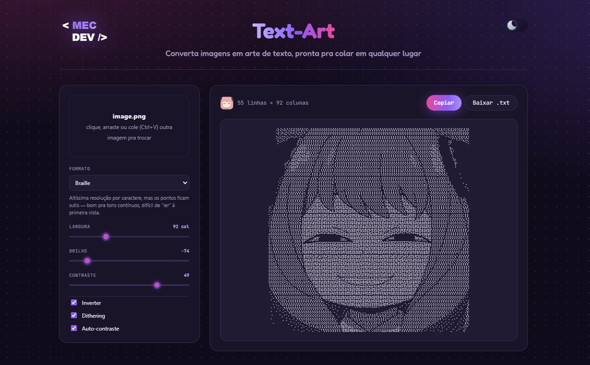

# Text-Art

Converte uma imagem em arte de caracteres — texto de verdade, selecionável,
copiável e colável em qualquer lugar (chat, editor, terminal). Roda
inteiro no navegador, sem backend: a imagem nunca sai da máquina de quem usa.



## Como funciona

Todo o núcleo de conversão vive em `src/core/`, é TypeScript puro (sem
dependência de DOM) e é testado isoladamente com Vitest.

1. **Grade** (`grid.ts`) — a imagem é dividida numa grade de células cujo
   tamanho depende da largura em colunas escolhida. A altura da grade é
   corrigida pela proporção real do glifo da fonte monoespaçada (medida em
   tempo real via `measureGlyphAspect.ts`), pra um caractere não ficar
   "achatado" — sem isso, texto normalmente sai mais alto que largo.
2. **Amostragem e ajustes** (`sampleValues.ts`, `luminance.ts`, `levels.ts`) —
   cada célula vira um valor de luminância (0–255), passa por auto-contraste
   (esticamento de níveis), brilho/contraste manuais e inversão opcional.
3. **Quantização com dithering** (`dither.ts`) — Floyd–Steinberg opcional pra
   espalhar o erro de arredondamento entre células vizinhas, o que evita
   bandas visíveis de transição e deixa gradientes suaves mesmo com poucos
   níveis de caractere disponíveis.
4. **Formatos de saída**, cada um mapeando a grade final pra caracteres:
   - **Bordas** (`convertEdges.ts`, padrão) — detecta contornos com o
     operador de Sobel e desenha um traço orientado (`- | / \`) onde há uma
     borda nítida; o resto vira rampa de densidade ASCII. A diferença
     importante deste modo: o Sobel roda **pixel a pixel na resolução
     original da imagem**, não na grade já reduzida — e cada célula de texto
     herda o traço de maior magnitude que ela contém (max-pooling). Isso é o
     que permite reconhecer line art com traço fino (comum em desenho estilo
     anime, sem gradiente de sombra) mesmo em larguras de coluna moderadas;
     calcular o gradiente só depois de reduzir a imagem faria um traço de
     poucos pixels desaparecer na média antes de virar borda.
   - **Braille** (`convertBraille.ts`) — cada caractere Unicode de Braille
     carrega uma sub-grade de 2×4 pontos, então o resultado tem 8× mais
     "resolução" por caractere que os outros modos — ótimo pra tons
     contínuos, mais difícil de reconhecer à primeira vista.
   - **ASCII clássico / ASCII estendido / Blocos** (`convertRamp.ts`,
     `ramps.ts`) — mapeiam luminância pra um caractere de densidade
     crescente ao longo de uma rampa (`" .:-=+*#%@"` etc.).
5. **Decodificação da imagem** (`src/lib/loadPixelBuffer.ts`) — usa
   `createImageBitmap` + `<canvas>` pra extrair os pixels crus, com limite de
   dimensão (1600px no maior lado) pra manter a conversão rápida mesmo em
   fotos grandes.

## Interface

- `src/App.tsx` — upload por clique, arraste ou colar (Ctrl/Cmd+V) da área de
  transferência, controles de formato/largura/brilho/contraste/inversão/
  dithering, preview em tempo real (debounced), copiar e baixar `.txt`.
- `src/hooks/useTheme.ts` — alterna entre tema escuro e claro (mesma
  identidade roxo/rosa nos dois), persistido em `localStorage` e aplicado via
  atributo `data-theme` no `<html>` antes do primeiro paint, pra não piscar
  o tema errado ao recarregar.

## Tecnologias

- [React 19](https://react.dev/) + [TypeScript](https://www.typescriptlang.org/)
- [Vite 8](https://vite.dev/) — dev server e build
- [Vitest](https://vitest.dev/) — testes do núcleo de conversão
- [oxlint](https://oxc.rs/docs/guide/usage/linter.html) — lint
- CSS puro (variáveis nativas pra tema/paleta, sem framework de UI)
- Canvas API do navegador pra decodificar a imagem — nenhuma lib externa de
  processamento de imagem

## Rodando localmente

Pré-requisitos: [Node.js](https://nodejs.org/) `^20.19` ou `>=22.12` (exigido
pelo Vite 8) e `npm`.

```bash
git clone https://github.com/merlinmec/pixel-type.git
cd pixel-type
npm install
npm run dev
```

Isso abre o servidor de desenvolvimento (normalmente em
`http://localhost:5173`, o terminal mostra a URL exata) com hot reload.

Outros scripts úteis:

```bash
npm run build     # build de produção em dist/
npm run preview   # serve o build de produção localmente
npm test          # roda os testes (Vitest)
npm run lint      # roda o lint (oxlint)
```

## Estrutura

```
src/
  core/         núcleo de conversão (puro TS, testável sem DOM)
  lib/          decodificação de imagem e medição de glifo (dependem do DOM)
  hooks/        useDebounced, useTheme
  assets/       logo
  App.tsx       interface
```
